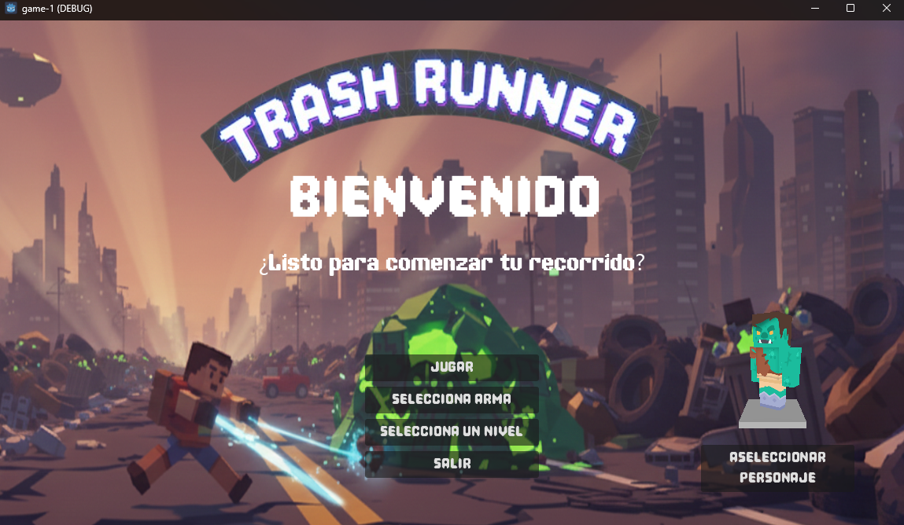
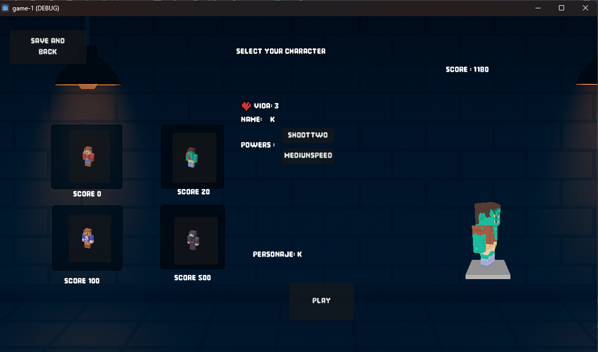
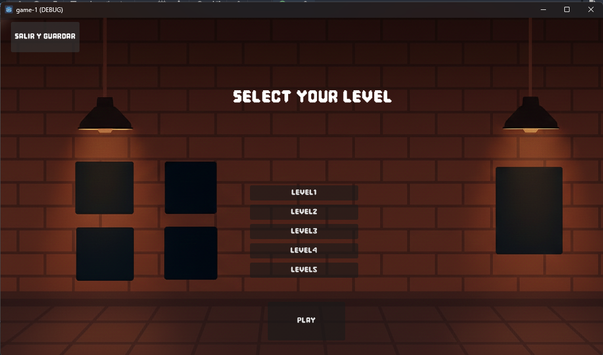
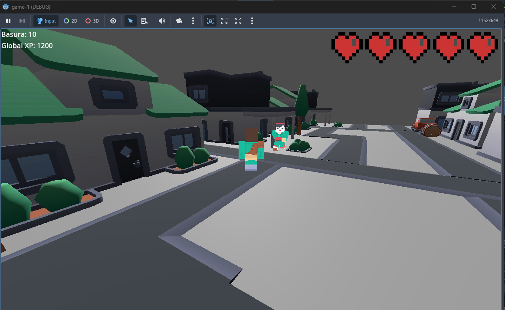
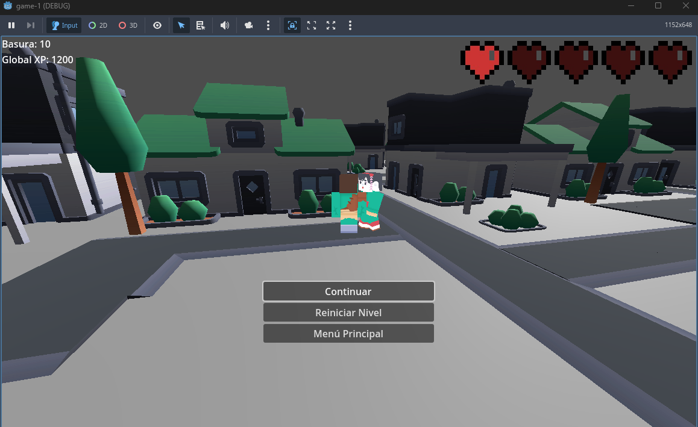
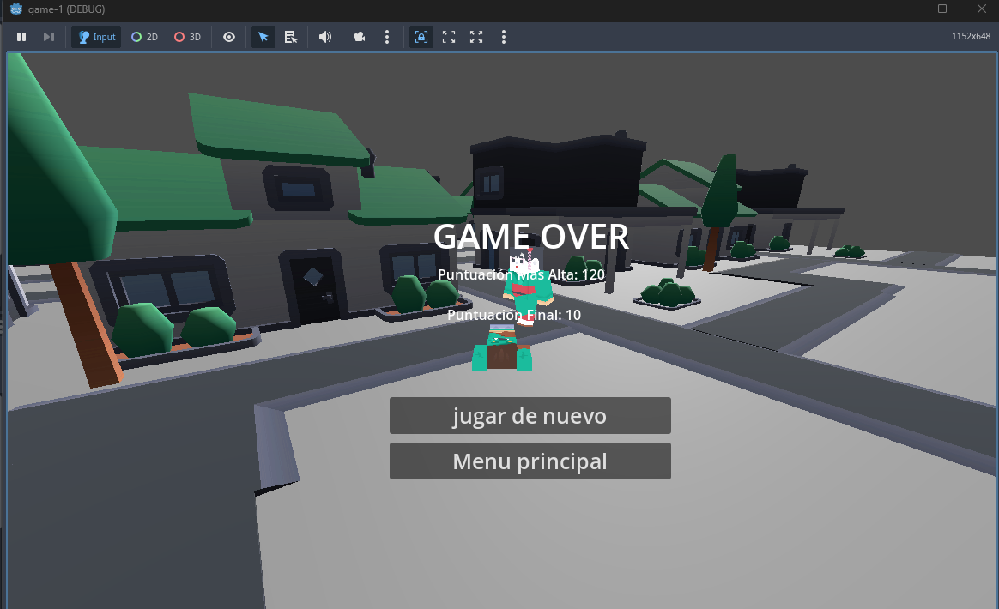
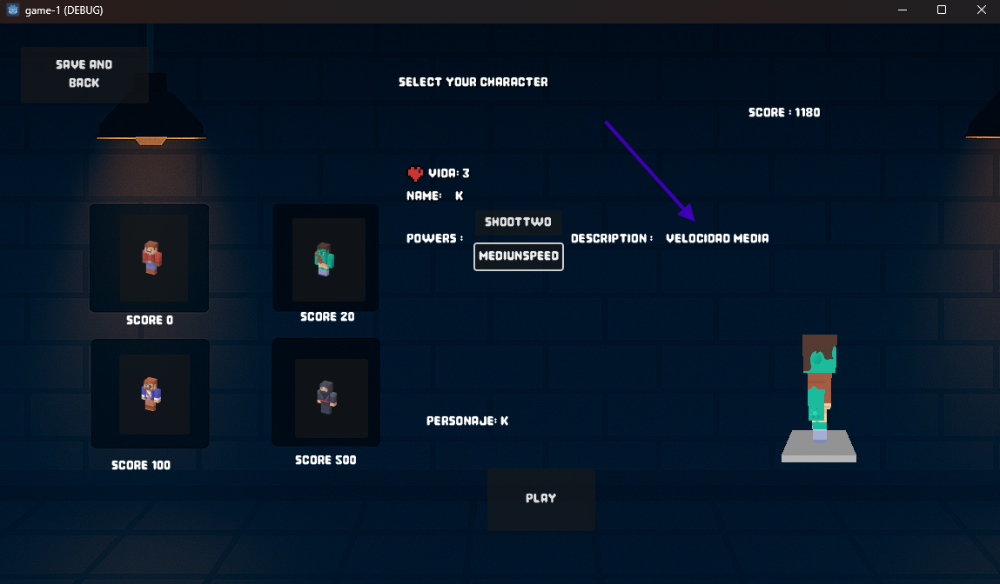
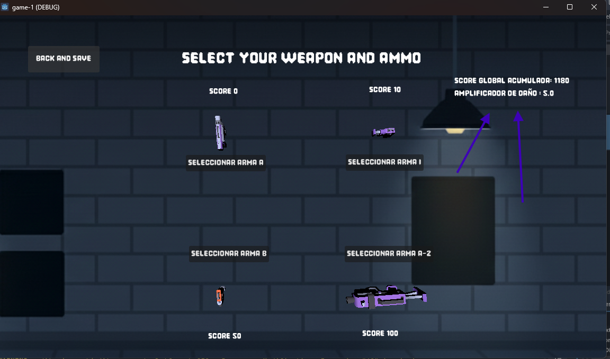

# Game 1

¡Bienvenido a Game 1!

Este proyecto es un juego desarrollado en Godot. A continuación se muestran algunas de las pantallas principales del juego para que puedas conocer su interfaz y funcionalidades.

## Menú Principal

## Selección de Personaje

## Selección de Nivel

## Pantalla de Juego

## Menú de Pausa

## Pantalla de Game Over

## Descripción de Poderes

## Menú de Armas y Amplificadores

---

¡Explora el juego y disfruta de la experiencia!

---

© 2025 Ilesandres

> Desarrollado con Godot Engine.

